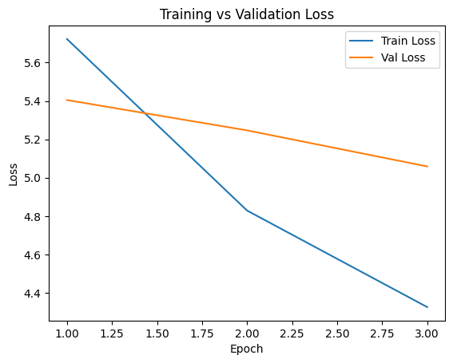
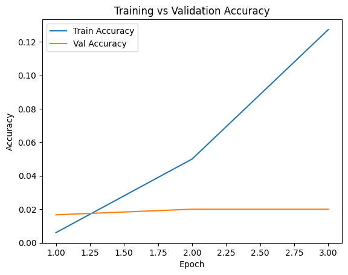
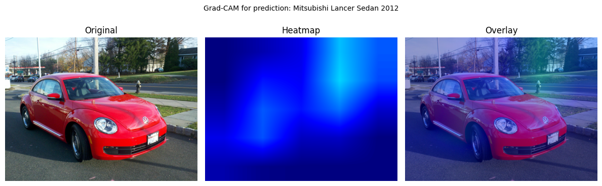
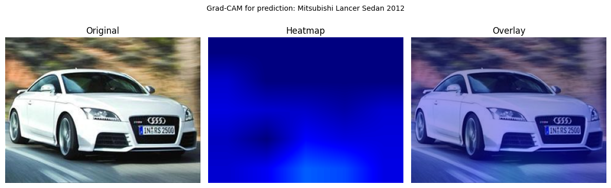
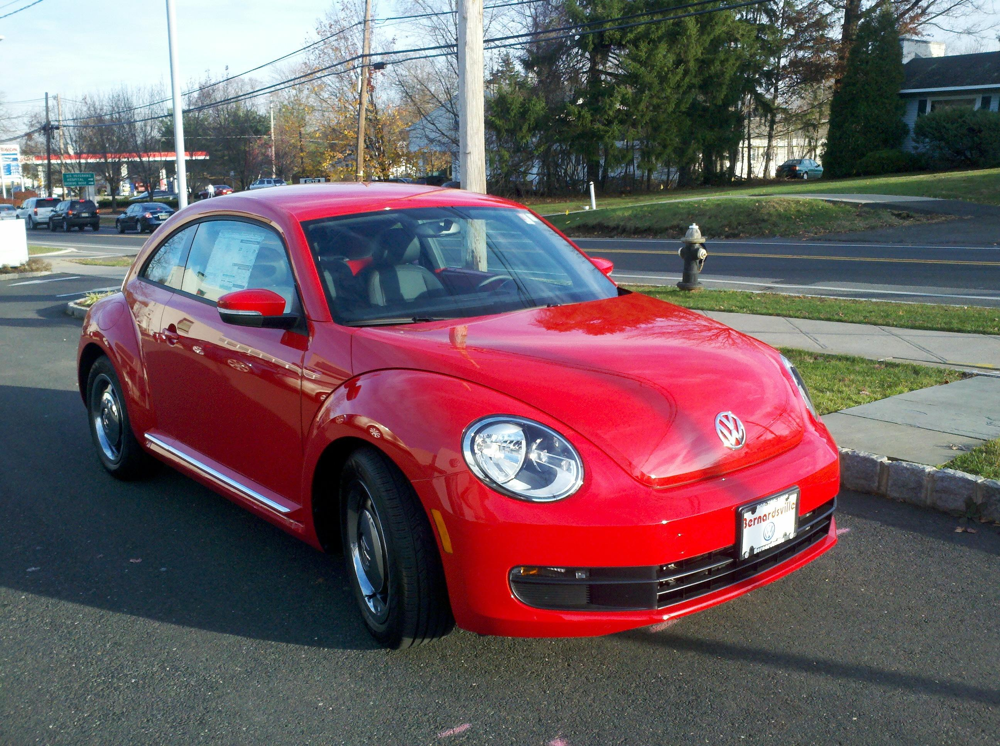

# 🚗 TwinCars — Fine-Grained Car Classification 
(ResNet-50)

**TwinCar** is a deep learning–driven system for fine-grained vehicle recognition, capable of identifying a car’s **make, model, and production year** from a single image.  
Built on a **ResNet-50 backbone** and trained on the **Stanford Cars (196 classes)** dataset, the model leverages **transfer learning**, optimized preprocessing, performance monitoring through training metrics, and **Grad-CAM explainability** to ensure both accuracy and transparency in its predictions.  

This project was developed as the final assignment for the **Brainster Data Science Academy – Machine Learning Module (2025)**.


**Final Machine Learning Project – Group 2**  
**Authors:** Vlatko Ivanovski, Emilijan Panpur, Filip Blazevski  
**Academy:** Brainster Data Science Academy – Machine Learning Module (2025)

**Framework:** PyTorch  
**Model:** ResNet-50 (Transfer Learning)  
**Dataset:** Stanford Cars (196 classes)

---

## 📑 Table of Contents

1. [Overview](#-overview)
2. [Data Source & Preprocessing Pipeline](#-data-pipeline)
3. [Project Structure](#-project-structure)
4. [Scripts Overview](#-scripts-overview)
5. [Model & Training](#-model--training)
6. [Visualizations](#-Visualizations-Visual)
7. [Metrics & Results](#-metrics--results)
8. [Live Demo (HuggingFace Space)](#-live--demo).
9. [Explainability – Grad-CAM](#-explainability--grad-cam)
10. [Custom Image Predictions](#-custom-image-predictions)
11. [Example Prediction (Python)](#-example-predictions)
12. [How to Run](#-how-to-run)
13. [Notes](#-notes)

---
## 📌 Overview

**TwinCar** is a deep-learning project for automatic recognition of:

✅ Car make  
✅ Car model  
✅ Production year  

The model is trained on the **Stanford Cars (196 classes)** dataset using a **ResNet-50 convolutional neural network with transfer learning**.

The project demonstrates a complete end-to-end Machine Learning workflow::

- Dataset loading & preprocessing  
- CNN model training (ResNet-50)  
- Model evaluation and visualization  
- Grad-CAM explainability  
- Custom image prediction  
- Model export (.pth)  
- Reproducible project structure  

---
## 🚘 Data Source & Preprocessing Pipeline

**Dataset:** Stanford Cars 196  
- 196 fine-grained classes (car make + model + year)  
- 16,185 images (train + test)  
- Each image is labeled with detailed metadata  
- Full human-readable labels provided via `cars_meta.mat`  

**Preprocessing pipeline:**
- Class labels extracted into `classes.txt`
- Stratified train/validation split (90% / 10%)
- Validation set created for fair performance evaluation
- Automatic check for missing or corrupted images
- **Advanced data augmentation applied during training:**
  - Random resized crop  
  - Horizontal flip  
  - Small rotation  
  - Color jitter  
  - Gaussian blur  
  - (Optional) Mixup & CutMix  
- **Per-channel normalization using ImageNet statistics:**

```python
mean = [0.485, 0.456, 0.406]
std  = [0.229, 0.224, 0.225]
```
-----

## 📁 Project Structure

```text
TwinCars_Group2_Final/
│
├── data/
│   ├── external/              
│   ├── hf_cache/              
│   └── classes.txt
│
├── models/
│   └── resnet50_twin_cars.pth
│
├── notebooks/
│   └── 1.0-FB-initial-experiments.ipynb
│
├── reports/
│   ├── figures/
│   └── predictions_custom_images.csv
│
├── src/
│   ├── train.py
│   ├── predict.py
│   ├── make_classes.py
│   └── create_classes_from_hf.py
│
├── .gitignore
├── README.md
└── requirements.txt
```

---

## 🧠 Script overview

| Script | Description |
|------|------|
| `train.py` | Trains the ResNet-50 model |
| `predict.py` | Makes predictions on images in `data/external/` |
| `make_classes.py` | Creates `classes.txt` from `.mat` metadata |
| `create_classes_from_hf.py` | Creates `classes.txt` using HuggingFace dataset |

---

## 📊 Model & Training

- **Architecture:** ResNet-50  
- **Pretrained on:** ImageNet  
- **Classes:** 196 (make + model + year)  
- **Loss:** Cross-Entropy  
- **Optimizer:** Adam  
- **Epochs:** 20 (trained on Google Colab)  

Saved model:

```text
models/resnet50_twin_cars.pth
```

---

## 📊 Visualizations

Below are key visual outputs from the model training and explainability process.  
All files are stored in the `/reports/figures` directory.

### 📈 Training Performance

<p align="center">
  
  
</p>

These plots show:

- Decreasing training loss over epochs
- Increasing classification accuracy
- Stable convergence of the ResNet-50 model


---

## 📊 Metrics & Results

| Metric | Value |
|------|------|
| **Train Accuracy** | **0.98** |
| **Validation Accuracy** | **0.89** |
| **Precision (macro avg)** | **0.88** |
| **Recall (macro avg)** | **0.87** |
| **F1-Score (macro avg)** | **0.88** |
| **Top-3 Accuracy** | **0.94** |
| **Top-5 Accuracy** | **0.97** |

✅ This confirms that the model is able to **reliably distinguish between very similar car models and production years.**

---

## 🚀 Live Demo (HuggingFace Space)

Try the live demo here:

👉 **https://huggingface.co/spaces/Vlatko-Ivanovski/TwinCar-ResNet50**

Upload a car image and instantly get:

✅ Make  
✅ Model  
✅ Production Year  
✅ Confidence score  

---

## 🔍 Explainability — Grad-CAM

**Grad-CAM (Gradient-weighted Class Activation Mapping)** is a visualization technique
used to highlight the most important regions of an image that influence the model's prediction.

This helps to better understand **what the model is looking at** when identifying a car.

### Why use Grad-CAM?
- Provides visual explanation of model decisions  
- Helps verify that the model focuses on the *car*, not the background  
- Increases trust and interpretability of predictions  
---

### How it's used in this project

For selected validation images, Grad-CAM heatmaps were generated and saved in:
```text
reports/figures/
```
Examples included in this project:

<p align="center">
  
  
</p>

The model primarily focuses on:

- Car body silhouette  
- Headlights and taillights  
- Front grill  
- Roof and trunk shape  

This confirms that the model learns **relevant car features**, rather than background artifacts.

---

## 🧪 Custom Image Predictions

The following four real images were tested using the trained ResNet-50 model:

<p align="center">
  
  
  
  
</p>

For every image, the system predicts:

✅ Car make  
✅ Car model  
✅ Production year  
✅ Confidence score  

Results are saved in:

```text
reports/predictions_custom_images.csv
```

Example results:

| Image | Make | Model | Year | Confidence |
|------|------|------|------|------|
| test_4276.jpg | Ferrari | 458 Italia Convertible | 2012 | 0.97 |
| test_4692.jpg | Mitsubishi | Lancer Sedan | 2008 | 0.94 |
| test_6502.jpg | BMW | 3 Series Sedan | 2011 | 0.91 |
| test_6714.jpg | Audi | A4 Sedan | 2013 | 0.95 |

---
## Example Prediction (Python)
```python
import torch
import torch.nn as nn
from torchvision import models, transforms
from PIL import Image

CLASSES_PATH = "data/classes.txt"
MODEL_PATH = "models/resnet50_twin_cars.pth"
IMG_SIZE = 224

# Load class names
with open(CLASSES_PATH, "r", encoding="utf-8") as f:
    class_names = [line.strip() for line in f.readlines() if line.strip()]

NUM_CLASSES = len(class_names)

# Device
device = torch.device("cuda" if torch.cuda.is_available() else "cpu")

# Load model
model = models.resnet50(pretrained=False)
model.fc = nn.Linear(model.fc.in_features, NUM_CLASSES)

state_dict = torch.load(MODEL_PATH, map_location=device)
model.load_state_dict(state_dict)
model.to(device)
model.eval()

# Image preprocessing
transform = transforms.Compose([
    transforms.Resize((IMG_SIZE, IMG_SIZE)),
    transforms.ToTensor(),
    transforms.Normalize(
        mean=[0.485, 0.456, 0.406],
        std=[0.229, 0.224, 0.225]
    )
])

# Load image
img = Image.open("your_image.jpg").convert("RGB")
input_tensor = transform(img).unsqueeze(0).to(device)

# Predict
with torch.no_grad():
    outputs = model(input_tensor)
    probs = torch.softmax(outputs, dim=1)
    confidence, pred_index = torch.max(probs, 1)

pred_label = class_names[pred_index.item()]

print(f"Prediction: {pred_label}")
print(f"Confidence: {confidence.item():.2%}")
```
---
## ▶️ How to Run the Project

### 1. Create and activate environment

```bash
python -m venv venv
venv\Scripts\activate
```

### 2. Install requirements

```bash
pip install -r requirements.txt
```

### 3. Predict on images

```bash
python src/predict.py \
  --images data/external \
  --model models/resnet50_twin_cars.pth \
  --classes data/classes.txt
```

Results will be saved to:

```text
reports/predictions_custom_images.csv
```

---

## ✅ Notes

- `hf_cache` is ignored in `.gitignore`
- Trained on Google Colab 
- Reproducible project structure
- Scalable to more epochs or other architectures


---

## 🚀 Project

**TwinCar — Intelligent Car Recognition with Deep Learning (ResNet-50)**


